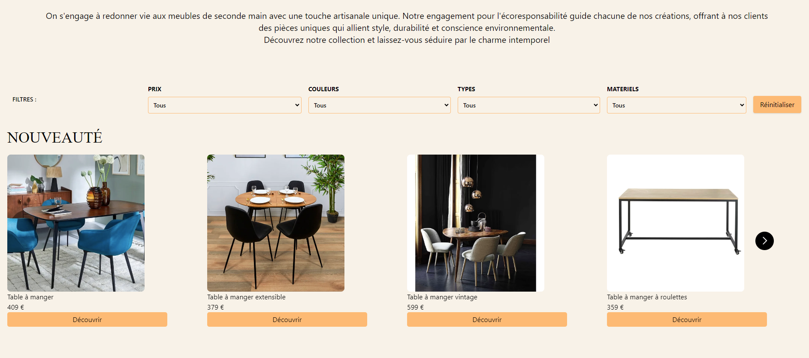
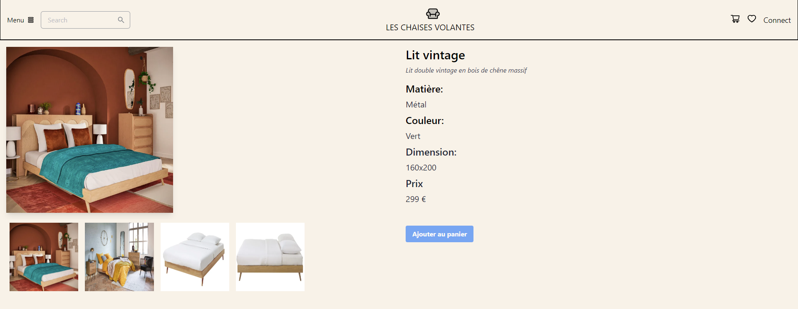

# [Les Chaises Volantes](https://plateforme-vente-meubles-chaisesvolantes-front.vercel.app/)

Looking for some new furniture? Browse through a myriad of items to furnish all your rooms and decorate an elegant home.

A collaborative student project, <i>Chaises Volantes</i> was made over the course of 10 days by half the team working on the front-end of the website, and the other half on the back-end. 
 At halfpoint, we switched roles in order for members to be involved in both sides. Each coder uses their own methods, thus offering us an opportunity to learn how to build upon code that's already started.
 We made it a point to meet daily as a group to discuss advancements, goals and difficulties some might have.

We experimented with Express, PostgreSQL and Supabase to support the back-end of the project, while using React and Node.js to set up the front-end.

A carousel with the newest items on display is available upon opening the home page.  

When scrolling down, each room gets a dedicated section with specific furniture to help fill the space according to the client's taste.  
  

See a product you like? Click on it to find out more.  

Collaborators: @chloetoma, @felikarina, @Hanaevernon, @StevanyF, @theomarci, and @stoyots
